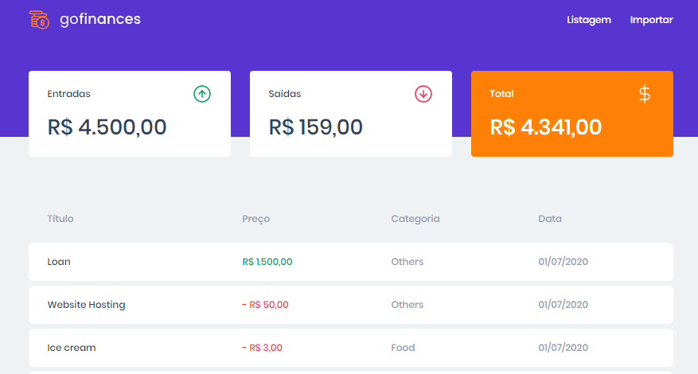

Projeto criado para o desafio do módulo 3 da rocketseat, Fundamentos ReactJS.
Projeto a ser criado no desafio será o GoFinances.

Go Finances é um sistema de gerenciamento e controle de finanças, onde você pode inserir
valores de entrada e saída de transações através de uma carga em CSV.
O modelo da carga pode ser encontrada [clicando aqui](https://github.com/iago1501/GoFinances-Backend/blob/master/src/database/template.csv):

## Configuraçõs Iniciais

Para rodar o projeto é necessário ter o backend também configurado, as instruções podem ser encontradas no arquivo Readme.md do projeto do backend em:
[https://github.com/iago1501/GoFinances-Backend](https://github.com/iago1501/GoFinances-Backend)

Após feitas as configurações do backend, é necessário realizar o clone deste repositório e não se esquecer de instalar as dependências do node com o comando "Yarn"

## Scripts disponíveis

Para rodar o projeto basta executar

### `yarn`

Para instalar todas as dependências de pacotes do NPM

### `yarn start`

Roda a aplicação em modo de desenvolvimento. 
Abra [http://localhost:3000](http://localhost:3000) para ver o projeto no browser.

### `yarn test`

Para executar os testes necessários para a aplicação ser considerada criada com sucesso

## Fundamentos

Neste projeto foram colocados em prática os conhecimentos adquiridos no módulo 3 do curso de React, e assim como no backend, o acréscimo da feature de upload de arquivos, além de também utilizarmos o próprio backend da última aplicação em Node criada, a GoFinances

- Axios;
- Styled Components;
- Typescript;
- Hooks;
- React-Routes;
- FormData;
- Promises;
